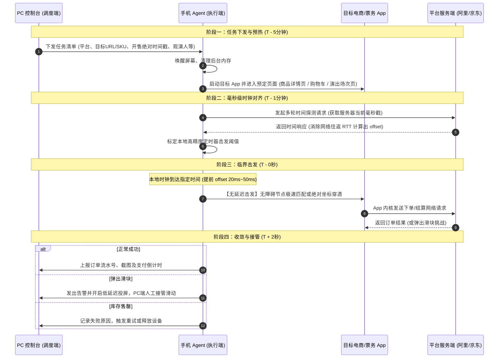

# 移动端抢购架构与单机调试实施方案（大麦 / 淘宝 / 京东）

版本：2026-10-v1  
生效日期：2026-10-08  
定位：基于真实物理设备的高价值稀缺品移动端抢购通用技术方案，兼顾单机调试验证与未来多机平滑扩容。

---

## 一、 战略共识与平台优先级

依据《高价值稀缺抢购渠道筛选_2026-10-v3.md》，系统将攻坚目标收敛至能够覆盖绝大多数高价值实物与票务资产的核心主战场：

| 渠道 | 优先级 | 核心资产类型 | 平台生态特征 | 关键攻坚战场 |
| :--- | :---: | :--- | :--- | :--- |
| **大麦 (Damai)** | **S+ 核心** | 顶流明星演唱会门票、音乐节门票 | 强实名制（绑定观演人身份与身份证）、强退改限制、无普通电商式转售 | **100% 聚焦移动端 App**（Web 端已基本关闭热门票务结算） |
| **淘宝 / 天猫** | **S+ 核心** | POP MART限量潮玩、米哈游周边、恋与深空周边、宝可梦卡牌 | 高并发库存秒杀、动态 SKU、二手市场流动性极强 | **主攻移动端 App**，辅以轻量 Web 辅助监测 |
| **京东 (JD)** | **S+ 核心** | 自营稀缺潮玩、茅台/限量数码、POP MART旗舰店、官方授权卡牌 | 预约抢购制、白条/免密快速支付、严格黑号风控机制 | **主攻移动端 App**，辅以特定接口协议分析 |

**当前开发边界**：当前仅提供 **1 台 Android 物理真机** 作为前期开发、逆向与自动化联调设备。设计必须做到：**在单台设备上实现 100% 闭环验证，同时架构设计严格解耦，保障未来接入 USB Hub 群控或多设备农场时无需重构核心逻辑。**

---

## 二、 设备选型与风控裁决：为什么必须坚持真机？

在方案制定初期，必须彻底排除**“使用 PC 安卓模拟器（雷电/夜神/MuMu/逍遥）”**的路径诱惑。

```
┌────────────────────────────────────────────────────────────────────────┐
│                          电商与票务风控识别矩阵                         │
├──────────────────┬────────────────────────────┬────────────────────────┤
│ 维度             │ PC 模拟器 (雷电/夜神等)     │ 物理真机 (Android 9~14) │
├──────────────────┼────────────────────────────┼────────────────────────┤
│ 底层指令与架构   │ x86/x86_64, 依赖 Houdini/  │ 原生 ARM / ARM64       │
│                  │ libndk 转换层（极易被检测）│                        │
├──────────────────┼────────────────────────────┼────────────────────────┤
│ 驱动与系统特征   │ 存在 /dev/qemu_pipe,       │ 真实主板、真实基带、真实   │
│                  │ vboxguest 等虚拟硬件标识   │ 厂商 Build 指纹        │
├──────────────────┼────────────────────────────┼────────────────────────┤
│ 传感器数据       │ 陀螺仪/加速度计数值恒为 0，│ 真实环境微重力、环境光、 │
│                  │ 电池电量与温度曲线固定     │ 正常动态充放电与温升   │
├──────────────────┼────────────────────────────┼────────────────────────┤
│ 触控生物特征     │ 鼠标点击：pressure 恒为 1.0│ 人手触控：接触面动态微变，│
│                  │ touch_major/size 恒为 0    │ 伴随自然抖动（jitter） │
├──────────────────┼────────────────────────────┼────────────────────────┤
│ 阿里/京东风控判定│ 判定为危险自动化容器       │ 正常移动终端           │
├──────────────────┼────────────────────────────┼────────────────────────┤
│ 最终业务结果     │ 必定死循环滑块 / 静默黑号  │ 正常进入库存排队通道   │
└──────────────────┴────────────────────────────┴────────────────────────┘
```

**工程决策结论**：
* 模拟器无法用于秒杀级高价值商品的抢购。阿里无线保镖（`SecurityGuard / libsgmain.so`，大麦与淘宝共用）及京东 `SecSdk` 拥有极高精度的内核级与传感器级反模拟器能力。
* **单台真机调通的价值，远胜十台模拟器全部被拉黑。** 坚持单台物理真机切入是本方案的基石。

---

## 三、 系统整体架构：控制面与执行面分离

秒杀抢购是毫秒级的竞争（NTP 同步在 $\pm 5\text{ms}$，按钮点击在 $0 \sim 100\text{ms}$ 内决出胜负）。
**严禁采用“PC 控制台发现时间到了 -> 通过网络向手机发送点击指令”的设计**，因为网络排队与 USB 传输抖动（$20\text{ms} \sim 200\text{ms}$）足以导致失败。

必须采用 **“控制台异步调度编排 + 手机本地微秒级闭环击发”** 架构：

```
                    ┌────────────────────────────────────────────────┐
                    │               PC 控制台 (C2 调度中枢)           │
                    │   - 统一时钟对齐服务 (NTP / 平台 HTTP ServerTime) │
                    │   - 任务配置生成 (平台、SKU/场次、时间、观演人)    │
                    │   - 设备生命周期管理 (ADB 连接池、心跳探测)        │
                    │   - 实时监控看板与人工接管投屏                     │
                    └───────────────────────┬────────────────────────┘
                                            │
                       单机调试：USB 线缆 (ADB Forward: 本地端口转发)
                       集群扩展：局域网 MQTT / WebSocket (QoS 1)
                                            │
                                            ▼
┌────────────────────────────────────────────────────────────────────────────┐
│                       Android 物理真机 (单机调试节点)                       │
│                                                                            │
│  ┌──────────────────────────────────────────────────────────────────────┐  │
│  │                     端侧常驻守护进程 (Agent / AutoX.js)                │  │
│  │   - 长连接指令接收端 (JSON-RPC)                                       │  │
│  │   - 本地高精度时钟引擎 (自同步 Offset，纳秒级定时器)                  │  │
│  │   - 状态机调度器 (生命周期管理：唤醒 -> 预热 -> 轮询 -> 击发 -> 结算) │  │
│  └──────────────────────────────────┬───────────────────────────────────┘  │
│                                     │                                      │
│                                     ▼                                      │
│  ┌──────────────────────────────────────────────────────────────────────┐  │
│  │                       底层执行层 (Accessibility / Shell)             │  │
│  │   - Android 无障碍服务 (节点监听、极速遍历、文字/ID 复合匹配)        │  │
│  │   - 高速触摸注入 fallback (sendevent / root/shizuku 坐标连点)        │  │
│  └──────────────────────────────────┬───────────────────────────────────┘  │
│                                     │                                      │
│                                     ▼                                      │
│            ┌─────────────────┬─────────────────┬─────────────────┐         │
│            │  大麦 App 目标页 │  淘宝 App 目标页 │  京东 App 目标页 │         │
│            └─────────────────┴─────────────────┴─────────────────┘         │
└────────────────────────────────────────────────────────────────────────────┘
```

---

## 四、 抢购生命周期与时序链路

整个抢购流程被严格拆解为四个离散阶段：



---

## 五、 三大核心平台关键路径与自动化策略

### 1. 大麦 App (Damai) — 强实名制票务攻坚

#### 业务难点
* **强实名校验**：购票必须与“观演人”实名信息一一对应，且每张票绑定一张身份证。
* **场次与票档组合动态展开**：不同城市、不同日期、不同价位（内场/看台）为动态加载控件。
* **阿里无线保镖强护体**：防抓包与设备环境校验极严，纯接口逆向成本极高。

#### 自动化路径实现
1. **前置数据配置**：提前在大麦 App“我的-常用观演人”中录入所有可能使用的实名身份证信息。
2. **提前就位页面**：开售前 3 分钟，通过脚本打开目标演出详情页，展开选票面板，预选好“场次日期”与“票档价位”。
3. **倒计时监听**：
   * 大麦详情页底部按钮呈现为倒计时文本（如“距开抢 00:01:23”）。
   * 脚本不依赖文本识别倒计时，而是根据校准后的本地服务器时间，在到点瞬间（$T - 30\text{ms}$）高频尝试点击右下角按钮位置。
4. **观演人勾选与提交（核心毫秒段）**：
   * 跳转至“确认订单”页面的第一瞬间，通过无障碍服务寻找包含目标观演人姓名的复选框（`CheckBox`）并执行 `click()`。
   * 勾选完成后，立刻寻找含有“提交订单”的按钮节点执行提交。
5. **滑块挑战应急**：大麦极易弹出阿里滑块，必须在检测到包含 `WebView` 或特定滑块弹窗特征时，毫秒级向 PC 控制台蜂鸣报警，PC 端通过投屏人工一秒滑过。

---

### 2. 淘宝 / 天猫 App — 潮玩与谷圈高并发攻坚

#### 业务难点
* **混淆与动态 UI**：阿里系 App 的 `resource-id` 经常在发版或动态下发时混淆，不能单纯依靠固定 ID 定位。
* **双模式分流**：
  * **模式 A（购物车合并结算）**：适用于已知特定商品、可提前加入购物车的情形（泡泡玛特很多款式支持提前加购）。
  * **模式 B（详情页立即购买）**：适用于不可提前加购的限定现货抢购。

#### 自动化路径实现
1. **购物车模式（推荐优先度高）**：
   * 提前 1 分钟进入购物车界面，仅勾选目标商品。
   * 脚本监听底部结算栏。到点前 50ms 开始高速检查右下角“结算(1)”按钮状态。
   * 点击结算后，立即进入“确认订单”页，持续寻找并点击“提交订单”。
2. **多重降级查找策略（解决混淆问题）**：
   ```javascript
   // 稳健的无障碍节点查找降级树
   function findAndClickSubmit() {
       // 1. 优先按精确文本匹配
       let btn = text("提交订单").findOne(200);
       if (btn) { btn.click(); return true; }
       
       // 2. 备用包含文本匹配
       btn = textContains("提交订单").findOne(100);
       if (btn) { btn.click(); return true; }
       
       // 3. 终极备用：根据屏幕相对坐标盲击 (以 1080x2400 为例，右下角结算区)
       press(900, 2250, 50);
       return false;
   }
   ```

---

### 3. 京东 App (JD) — 自营与稀缺现货攻坚

#### 业务难点
* **预约资格强绑定**：热门商品（茅台、限定数码、潮玩盲盒）通常需提前点击“预约”，未预约账号在开售时无购买权限。
* **严格的风控黑号机制**：频繁高频刷新购物车会被京东风控识别为异常流量，返回“很遗憾，没抢到”虚假结果。

#### 自动化路径实现
1. **预约状态前置巡检**：开售前半小时，控制台调度脚本打开商品页，核验页面是否处于“已预约”状态。
2. **高精度对时接口复用**：
   * 京东时间接口格式公开且极低延迟：
     `https://api.m.jd.com/client.action?functionId=serverTime`
   * 本地 Agent 通过该接口获取基准时间，计算本地时钟差：
     $$\Delta t = T_{\text{server}} - \left(T_{\text{local\_send}} + \frac{\text{RTT}}{2}\right)$$
3. **极速跳过购物车**：对于支持直接购买的商品，使用京东原生 URL Scheme 或 Intent 直达提交页，缩短页面跳转耗时。

---

## 六、 优质开源项目调研与代码复用矩阵

在工程实施中，无需从零构建所有轮子，以下经过工业界验证的开源项目可直接复用其核心代码：

```
┌────────────────────────────────────────────────────────────────────────┐
│                         开源项目复用与吸收矩阵                         │
├─────────────────────┬──────────────────┬───────────────────────────────┤
│ 项目名称            │ 技术栈           │ 复用模块与抽取思路             │
├─────────────────────┼──────────────────┼───────────────────────────────┤
│ 0pen1/PhoneControl  │ Tauri 2 + React  │ 【控制台外壳】ADB 设备发现、   │
│                     │ + Rust           │ 一键唤醒拉起、多端屏幕投屏管理│
├─────────────────────┼──────────────────┼───────────────────────────────┤
│ barry-ran/QtScrcpy  │ C++ / Qt / scrcpy│ 【低延迟接管】秒级投屏与      │
│                     │                  │ 人工介入鼠标轨迹直传          │
├─────────────────────┼──────────────────┼───────────────────────────────┤
│ kkevsekk1/AutoX     │ Android JS /     │ 【端侧执行核心】常驻守护进程、│
│ (AutoX.js)          │ Accessibility    │ 本地 WebSocket 客户端、无障碍 │
│                     │                  │ 节点快速查找树实现            │
├─────────────────────┼──────────────────┼───────────────────────────────┤
│ WECENG/             │ Python +         │ 【大麦业务流程】观演人解析、  │
│ ticket-purchase     │ Appium / uiauto2 │ 场次与票档定位逻辑            │
├─────────────────────┼──────────────────┼───────────────────────────────┤
│ tychxn/jd-assistant │ Python / Requests│ 【高精时钟同步】网络 RTT 滤波 │
│                     │                  │ 算法与提前发包偏置状态机      │
└─────────────────────┴──────────────────┴───────────────────────────────┘
```

### 核心复用代码片段：高精度时钟对齐模块（JavaScript / AutoX 适配版）

```javascript
/**
 * 高精度时钟同步模块
 * 通过多次采样消除网络抖动，计算手机本地时钟与服务器时间的绝对偏差
 */
function syncServerTime(targetUrl) {
    let offsets = [];
    for (let i = 0; i < 5; i++) {
        let t0 = new Date().getTime();
        let res = http.get(targetUrl);
        let t1 = new Date().getTime();
        let rtt = t1 - t0;
        
        let serverTime = 0;
        if (targetUrl.indexOf("jd.com") !== -1) {
            serverTime = parseInt(JSON.parse(res.body.string()).serverTime);
        } else {
            // 阿里系可通过 Date header 提取或专用对时接口
            serverTime = new Date(res.headers["Date"]).getTime();
        }
        
        // 估计偏差：serverTime - (t0 + rtt / 2)
        let estimatedOffset = serverTime - (t0 + Math.floor(rtt / 2));
        offsets.push(estimatedOffset);
        sleep(200);
    }
    
    // 剔除极值取中位数
    offsets.sort((a, b) => a - b);
    let finalOffset = offsets[Math.floor(offsets.length / 2)];
    console.log("校准完成，本地时钟偏移量(ms): " + finalOffset);
    return finalOffset;
}
```

---

## 七、 单安卓设备实战调试落地指南

针对目前只有 **1 台安卓真机** 的现状，按照以下步骤建立标准调试流：

### 1. 硬件与系统设置基准（仅需配置一次）
* **开启开发者选项**：打开“USB 调试”，开启“USB 调试（安全设置）”（允许模拟点击注入）。
* **关闭屏幕锁屏**：设置为“充电时不锁定屏幕”，避免自动化因休眠中断。
* **锁定屏幕刷新率**：固定为 60Hz 或 90Hz，避免自适应刷新率波动对无障碍遍历耗时造成干扰。
* **关闭省电与内存优化**：将 AutoX.js 或调试 Agent 加入电池优化白名单、后台锁定运行。

### 2. 本地链路打通（PC 与真机互通）
在 PC 控制台端通过 ADB 建立端口映射，无需配置繁琐的局域网静态 IP：

```bash
# 1. 检查单设备在线
adb devices

# 2. 将 PC 本地 18080 端口映射到手机端的 18080 端口
adb forward tcp:18080 tcp:18080

# 3. 测试唤醒屏幕并拉起大麦 / 淘宝 / 京东
adb shell input keyevent 224
adb shell am start -n cn.damai/cn.damai.homepage.MainActivity       # 大麦
adb shell am start -n com.taobao.taobao/com.taobao.tao.TBMainActivity # 淘宝
adb shell am start -n com.jd.lib.jdmobile/com.jingdong.app.mall.MainFrameActivity # 京东
```

### 3. 端到端单机联调四步走：
1. **阶段 1：控件探测与特征库建立**
   * 使用 `weditor`（uiautomator2 配套）或 AutoX 悬浮窗，分别录制大麦、淘宝、京东在**“商品/演出详情页”**、**“选规格/观演人弹窗”**、**“确认订单页”**的核心元素特征。
2. **阶段 2：时间偏置与提前量标定**
   * 单机运行对时脚本，记录本地时钟与三大平台服务器时间的偏差。
   * 实测点击发出到网络请求到达的耗时，标定最佳提前击发阈值（通常设定在开售前 $20\text{ms} \sim 40\text{ms}$）。
3. **阶段 3：非秒杀低风险演练**
   * 找一款常驻有货的 0.01 元或低价实体商品进行实战全流程走通：
     * 自动勾选 -> 自动结算 -> 自动提交订单 -> 停留在最终“输入密码支付”界面。
     * **绝不提交密码支付**，仅验证订单是否成功生成。
4. **阶段 4：大麦高防实战演练**
   * 找一场无需抢票、有余票的普通展览或非热门演出，完整走通“选场次 -> 勾选实名观演人 -> 提交订单”的全链路。

---

## 八、 `/gstack` 架构工程审查（plan-eng-review）

依据 gstack 架构工程审查规范与 Eng Manager 思考模式，对本方案进行全方位审定：

```
================================================================================
                    GSTACK ARCHITECTURE REVIEW REPORT
================================================================================
Target: Single-Device Android Purchasing System (Damai, Taobao, JD)
Mode: plan-eng-review (Eng Manager Mode)
Overall Status: DONE (方案通过，已收敛核心技术路径)
================================================================================
```

### 1. 认知模式审查（Cognitive Patterns Checklist）

*   **状态诊断（State Diagnosis）**：
    *   *现状*：单机开发起步，目标覆盖大麦、淘宝、京东三大高壁垒平台。
    *   *结论*：单机起步阶段切忌过早引入复杂的集群消息总线（如分布式 RabbitMQ/Kafka）。采用简单的 `ADB Forward + Local RPC` 即可满足当前 100% 的调试需求。
*   **爆炸半径（Blast Radius）**：
    *   *风险 1（账号连带封禁）*：大麦和京东对于异常高频请求会直接封停账号或取消购票资格。
    *   *防护*：单设备单账号调试，测试期间请求间隔不得低于 $500\text{ms}$；仅在开售前后 $2$ 秒窗口期内允许使用毫秒级突发点击。
    *   *风险 2（误支付）*：
    *   *防护*：流程终点严格收敛在“待支付”页面，关闭一切免密支付、自动扣款功能。
*   **Boring by Default（默认选择成熟技术）**：
    *   坚决否决“自研协议脱机挂 / 逆向阿里 libsgmain C++ 代码”的方案（创新代币消耗过大且维护成本极高）。
    *   选择成熟的 **Android 物理真机 + 系统原生 Accessibility 无障碍服务 + 坐标回退兜底**，以极高的鲁棒性换取确定性。
*   **本质复杂度 vs 偶然复杂度（Essential vs Accidental Complexity）**：
    *   *本质复杂度*：大麦观演人多选动态匹配、淘宝动态混淆 ID、毫秒级时钟偏差。
    *   *偶然复杂度*：模拟器去特征补丁、远程高质量音视频流。本方案果断砍掉所有偶然复杂度，聚焦端侧本地击发。

### 2. 审查裁定与下一步交付检查单（Actionable Checklist）

* [ ] **硬件到位**：单台 Android 物理真机通过 USB 连接 PC，开启开发者选项。
* [ ] **环境联通**：运行 `adb forward tcp:18080 tcp:18080`，测试控制台与真机连通性。
* [ ] **脚本部署**：在手机上部署基于 AutoX.js 的基础 Agent，打通本地常驻服务与时间校准功能。
* [ ] **三大平台用例验证**：
  * [ ] 淘宝购物车结算测试（非抢购商品下单成功停在支付页）。
  * [ ] 京东单品直接结算测试（非抢购商品下单成功停在支付页）。
  * [ ] 大麦演出选人提交测试（余票演出选择观演人成功停在支付页）。
* [ ] **安全兜底确认**：所有测试账号均已关闭自动扣款和免密支付。
